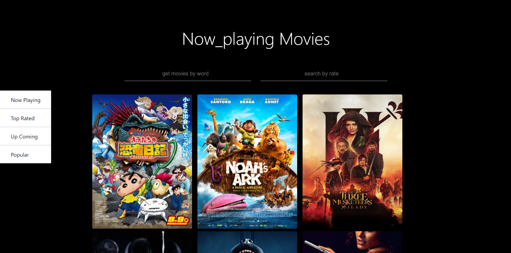

# Movie_API_Project
<ul><h2>Demo</h2>
    <li>https://mohammedelsisi21.github.io/Movie_API_Project/</li>
</ul>

<h2>Project Description</h2>

This project is a movie discovery application that dynamically updates with the latest films. It is built using a robust API that automatically refreshes content with newly released movies.

<ul><h3 style="padding: 0px ; margin:0px">Key Features</h3>
    <li>Cross-Platform Support: Works seamlessly on all devices.</li>
    <li>Dynamic Content: The API updates regularly with the latest movie releases.</li>
    <li>Interactive Buttons:
        <ul>
            <li>No Link: Displays movies without available streaming links.</li>
            <li>Related: Shows movies related to the selected one.</li>
            <li>Upcoming: Lists upcoming movies.</li>
            <li>Publisher: Displays movies from specific publishers.</li>
        </ul>
    </li>
    <li>Search Functionality:<ul>
        <li>Search: Allows searching through the movie database.</li>
        <li>Search by Rating: Filters movies based on ratings.</li>
        <li>Search by Movies: Enables searching specifically within movie titles.</li>
    </ul>
    </li>
</ul>

This project is perfect for movie enthusiasts who want to stay updated with the latest films and discover new movies efficiently.

<h2>Project Screenshot</h2>
